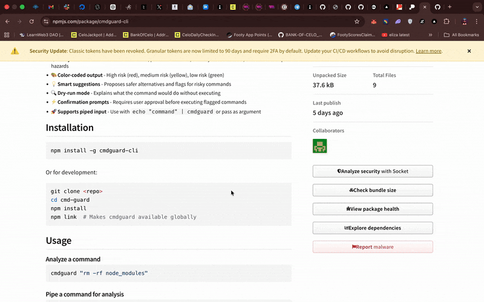

# cmdguard

A lightweight Node.js CLI tool that analyzes shell commands for safety risks before execution. It provides colored risk warnings, suggests safer alternatives, and optionally executes confirmed commands.



## Features

- 🛡️ **Analyzes commands for risks** - Data loss, permission issues, security vulnerabilities, resource cleanup hazards
- 🎨 **Color-coded output** - High risk (red), medium risk (yellow), low risk (green)
- 💡 **Smart suggestions** - Proposes safer alternatives and flags for risky commands
- 🔍 **Dry-run mode** - Explains what the command would do without executing
- ⚡ **Confirmation prompts** - Requires user approval before executing flagged commands
- 🚀 **Supports piped input** - Use with `echo "command" | cmdguard` or pass as argument

## Installation

```bash
npm install -g cmdguard-cli
```

Or for development:

```bash
git clone <repo>
cd cmd-guard
npm install
npm link  # Makes cmdguard available globally
```

## Usage

### Analyze a command
```bash
cmdguard "rm -rf node_modules"
```

### Pipe a command for analysis
```bash
echo "docker system prune -a" | cmdguard
```

### Simulate only (no execution prompt)
```bash
cmdguard "git push --force" --simulate
```

### Show detailed breakdown
```bash
cmdguard "chmod 777 file.txt" --explain
```

## Walkthrough

Watch the quick walkthrough (GIF):


If the image doesn’t load, open directly: [public/cmd-guard-demo-ezgif.com-optimize.gif](public/cmd-guard-demo-ezgif.com-optimize.gif)

## Examples

### High-risk command: Delete with force
```bash
$ cmdguard "rm -rf /tmp/test"

⛔ HIGH RISK: rm

▸ Deletes files/directories. Recursive mode (-rf) deletes everything in path WITHOUT confirmation.

Risk Details:
  [-rf] Recursively deletes without confirmation

Suggestions:
  → Safer: rm -ri <path>
    Interactive mode prompts before each deletion
  • Interactive mode prompts before each deletion

Dry-run: Would delete: /tmp/test (recursively, with all contents) WITHOUT recovery.

▶ Execute this command? (y/n):
```

### Medium-risk command: Git operations
```bash
$ cmdguard "git reset --hard"

⛔ HIGH RISK: git

Risk Details:
  [--hard] Discards all uncommitted changes irreversibly

Dry-run: Would discard all uncommitted changes. Files would revert to last commit state.
```

### Low-risk command: Safe operation
```bash
$ cmdguard "ls -la"

✓  LOW RISK: ls

▸ List directory contents.
```

## Supported Dangerous Commands

cmdguard recognizes patterns in these common tools:

- **rm** - File deletion with `-rf`, `-f`, `-r`
- **git** - Force push, hard reset, force clean
- **docker** - System prune, image removal, container deletion
- **dd** - Raw device operations
- **chmod** - Insecure permission changes (777)
- **chown** - Recursive ownership changes
- **curl/wget** - Piping to shell
- **sudo** - Elevated privilege execution

## Flags

- `--simulate` - Only analyze and explain; do not prompt for execution
- `--rewrite` - Show safer command variant
- `--explain` - Show detailed breakdown (future enhancement)

## How it Works

1. **Parse command** - Extract tool and arguments
2. **Risk detection** - Match against known dangerous patterns
3. **Generate explanation** - Describe what the command does
4. **Suggest alternatives** - Provide safer variants if available
5. **Prompt for confirmation** - Ask user before executing (unless `--simulate`)
6. **Execute safely** - Use `child_process.spawn` for isolated execution

## Development

### Run tests
```bash
npm test
```

### Test with local build
```bash
node bin/cmdguard.js "command to test"
```

### Directory structure
```
bin/cmdguard.js      # CLI entry point
src/
  ├── analyzer.js      # Command parsing & risk detection
  ├── riskPatterns.js  # Predefined dangerous patterns
  ├── suggestions.js   # Safer alternative mappings
  └── formatter.js     # Colored output formatting
test/
  └── analyzer.test.js # Unit tests
```

## Contributing

Contributions welcome! To add support for new dangerous commands:

1. Add pattern to `src/riskPatterns.js`
2. Add safer alternative to `src/suggestions.js` (optional)
3. Add test case to `test/analyzer.test.js`
4. Run `npm test` to verify

## License

MIT

## Disclaimer

This tool provides analysis and recommendations based on common patterns. Always review commands carefully before execution. The author assumes no responsibility for any damage caused by executed commands.
